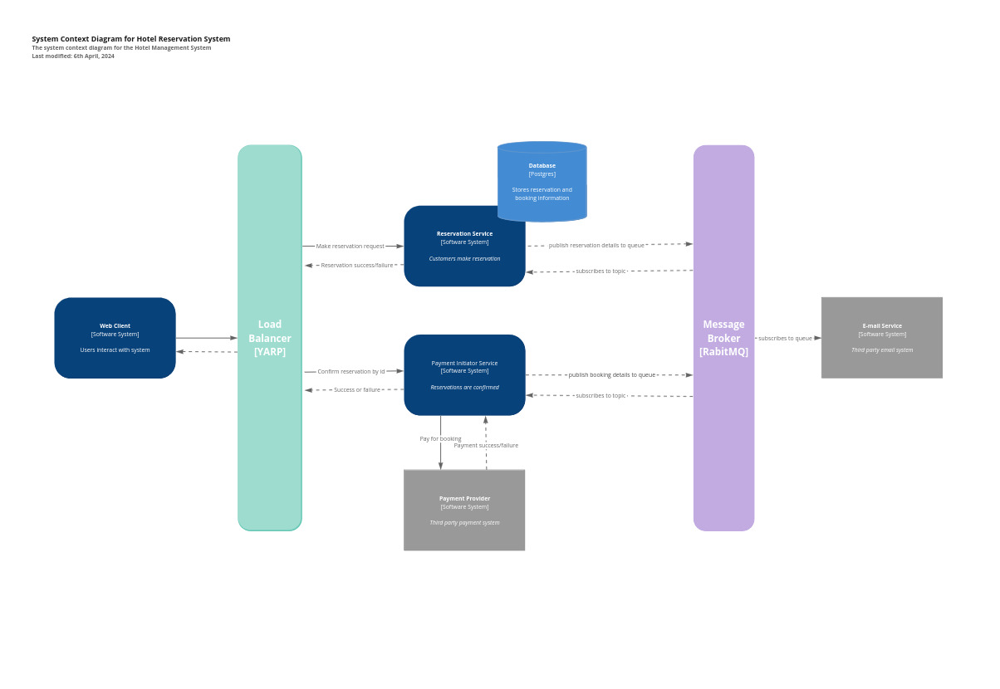

# Hotel Reservation System

<!-- [](https://github.com/kimfom01/HotelBackend/actions/workflows/dotnet.yml) [](https://sonarcloud.io/summary/new_code?id=kimfom01_HotelReservationSystem) -->

## :wave: About this project

This is an implementation of a hotel reservation system

## :game_die: Usage

Guests can fill the make reservation on the website and pay for the reservation.

## :heavy_check_mark: Business Goals and Objectives

The primary goal is to create an easy to use platform where guests can make reservation.

## :fire: Features

1. Make reservations
2. Receive email with reservation details
3. Pay for reservation

## :hotsprings: Frameworks

- **Back:** C#, ASP.NET Core, RabbitMQ, PostgreSQL, Swagger
- **Front:** TypeScript, React, MUI
- **CI/CD:** Git, GitHub Actions

<!-- ## :heavy_exclamation_mark: Prerequisites

ToDo

## :wrench: Installation

ToDo

## :ferry: Docker compose

### Front (subject to change)

Navigate to `/frontend` directory

```bash
cd /front
```

#### Add environment variables in .env file in `/front/` directory

Replace `<<placeholder>>` with actual

```plaintext
VITE_API_URL=http://localhost:8081/api/v1 #<<this is the order service because we haven't setup api gateway>>
VITE_AUTH_LOGIN_URL=http://localhost:8080/realms/prototype/protocol/openid-connect/token #<<this is keycloak url>>
VITE_AUTH_GRANT_TYPE=<<place your grant type from keycload (currently "password")>>
VITE_AUTH_CLIENT_ID=<<place your client id from keycloak>>
VITE_AUTH_CLIENT_SECRET=<<place your client secret form keycloak>>
VITE_AUTH_REGISTER_URL=http://localhost:8082/keycloak/register #<<registration end point from user service>>
VITE_APP_TITLE=Quests Manager
VITE_YANDEX_API_KEY=<<your yandex api key here>>
```

#### Build and Run

```bash
docker compose up -d
```

To rebuild the image, add `--build`

#### Open the [http://localhost:3000](http://localhost:3000) to access the website -->

## :bookmark_tabs: Requirements

### Glossary

### Functional requirements

- Guest should be able to make reservation
- Guest should be able to cancel reservation
- Guest should receive an email on successfull creation of reservation
- Guest should receive an email on successfull payment of reservation
- Guest should be able to retrieve reservation using a link
- Guest should be able to retrieve reservation by id
- Guest should be able to view available rooms
- The system should be able to auto-fill guest profile if email address is valid
- Guest should validate email address by verification link
- Guest should be able to pay for reservation
- Guest should be able to cancel payment

### Non-functional requirements

<!--  -->

<!-- ### User stories

 -->

## :art: Design

In Progress

## :hammer: Architecture



<!-- ## :link: Links

- [Swagger]()
- [Backend]()
- [Figma]() -->

<!-- ## :movie_camera: Demo

 -->

## :pencil2: Contributing

If you have a suggestion that would make this better, please fork the repo and create a pull request:

1. Fork the Project
2. Create your Feature Branch (`git checkout -b feature`)
3. Commit your Changes (`git commit -m 'Add some AmazingFeature'`)
4. Push to the Branch (`git push origin feature`)
5. Open a Pull Request

<!-- ## :lock: License

[](https://creativecommons.org/licenses/by/4.0/) -->

<!-- ## :v: Credits

This project was done by:

[Kim Fom](https://github.com/kimfom01)
-->
