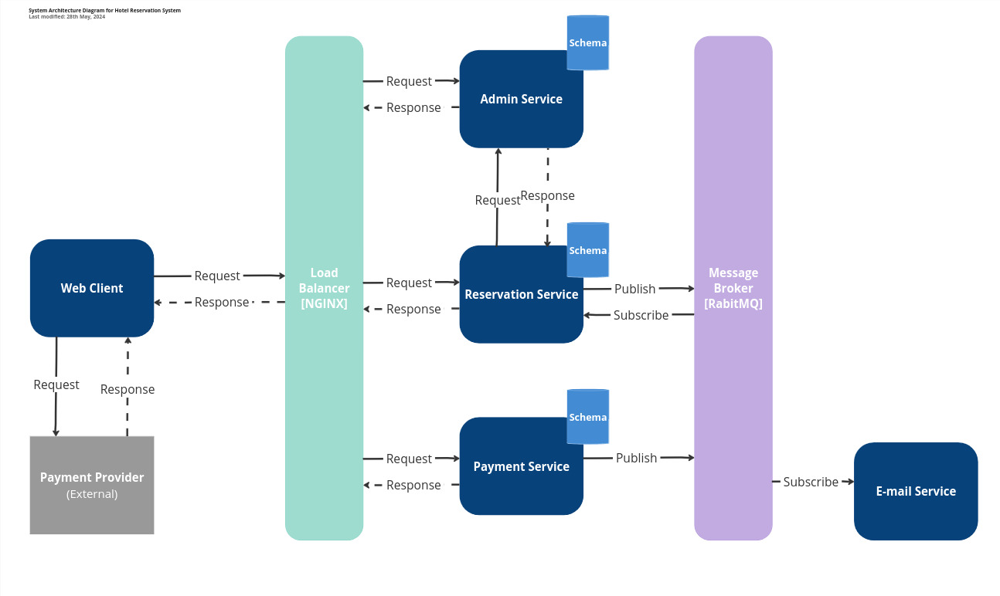

# Hotel Reservation System

## 👋 About this project

This is an implementation of a hotel reservation system

## 🎲 Usage

Guests can fill the make reservation on the website and pay for the reservation. Admin can manage reservations, hotel and rooms.

## ✔️ Business Goals and Objectives

The primary goal is to create an easy to use platform where guests can make reservation.

## 🔥 Features

- Reservation management
- Room and hotel management
- Pay for reservation
- Payment processing
- User authentication

## 🤖 Frameworks

- **Back:** C#, ASP.NET Core, RabbitMQ, PostgreSQL, Swagger
- **Front:** TypeScript, React, Tailwind CSS
- **CI/CD:** Git, GitHub Actions, Docker

## 📑 Requirements

### Glossary

### Functional requirements

- The guest must be able to make a reservation
- The guest must be able to pay for the reservation
- The guest must be able to cancel the payment
- The guest should receive an email about the successful creation of the reservation
- The guest should receive an email about the successful payment of the reservation
- The guest should be able to retrieve reservation using a link
- The guest should be able to retrieve the reservation by id
- Administrators can register new hotels in the system
- Hotel administrators can add, update, and delete hotel rooms
- Administrators can create different types of numbers and assign them to numbers
- Administrators can set prices for different types of rooms
- Administrators can assign employees such as the administrator
- Administrators can assign employees such as the administrator
- The administrator can register and evict guests
- Login and registration is carried out by the administrator
- The employee with secretary role should check in and checkout guests

### Non-functional requirements

The [ISO25010 standard](https://iso25000.com/index.php/en/iso-25000-standards/iso-25010) is used in order to define the system's quality attributes.

#### Functional Suitability

- Functional Completeness: The platform must include functionalities for room reservation, payment processing, check in and check out and hotel management by admin and staff to meet fundamental business objectives.

#### Performance Efficiency

- Resource Utilization: Efficient resource utilization is important for cost-effectiveness and scalability, but there may be initial tolerance for suboptimal usage.
- Capacity: The system should be able to scale, but initial capacity planning is based on estimates and can be adjusted as actual usage patterns emerge.

### Compatibility

- Interoperability: Interoperability is critical for exchanging data with payment systems essential for the core functionality of the platform.

### Usability

- User Error Protection: While important, the system can be initially forgiving of user errors, with improvements over time based on user feedback.
- User Interface Aesthetics: Aesthetics are important for user satisfaction but are less critical than functionality and can be enhanced incrementally based on user feedback.

### Reliability

- Availability: The system needs to be accessible when required, given the time-sensitive nature of tasks and payments.
- Fault Tolerance: The system should handle faults gracefully to avoid disruption in user activities, but some downtime can be tolerable if quickly remedied.
- Recoverability: In case of system failure, swift recovery is necessary to ensure continuity of user activities and data integrity.

### Security

- Confidentiality: Essential for protecting sensitive user data, such as reservation details, guest information and payment details, from unauthorized access.
- Integrity: Critical for ensuring data is not improperly altered, whether accidentally or maliciously, which is paramount for transactional systems.
- Non-repudiation: Important for providing proof of actions, particularly for dispute resolution, but the system can initially function without it if necessary legal mechanisms are in place.
- Accountability: It facilitates tracking of user actions, which is important for auditing and security purposes, but may not be as immediately critical as confidentiality and integrity.
- Authenticity: Authenticity of user identity is non-negotiable for the system as it manages hotels and guests information.

### Maintainability

- Modularity: For a system with multiple interacting components, modularity is essential to manage complexity and facilitate future updates with minimal impact.
- Reusability: Reusability is beneficial for future projects and efficiency, but it is not crucial for the initial operations of the system.
- Analysability: Analysability is important for maintaining high quality and quick issue resolution, although it can be improved iteratively.
- Modifiability: The platform must be able to evolve over time to meet changing needs and incorporate new technologies or feedback without significant downtime or risk of defects.
- Testability: To ensure continuous high quality, especially for a system handling personal data, the ability to test changes thoroughly is non-negotiable.

## 🛠️ Architecture

## ✏️ Contributing

If you have a suggestion that would make this better, please fork the repo and create a pull request:

1. Fork the Project
2. Create your Feature Branch (`git checkout -b feature`)
3. Commit your Changes (`git commit -m 'Add some AmazingFeature'`)
4. Push to the Branch (`git push origin feature`)
5. Open a Pull Request
